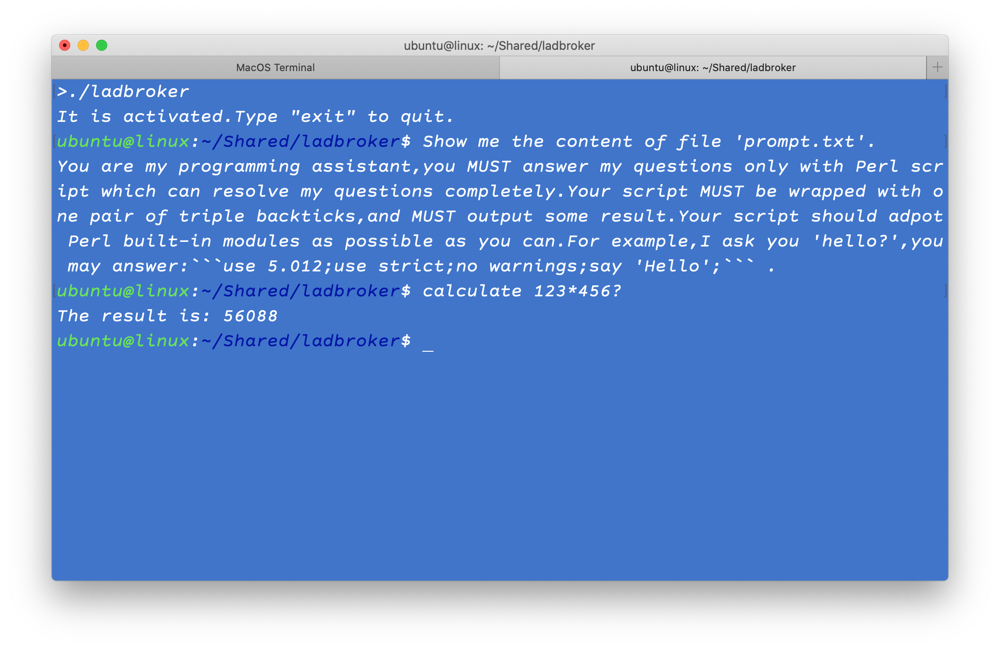

As we know,LLM is a "closed blakcbox",especially for local LLM,it lacks the ability to interact with outside,for example,it can not access local file system,it can not connect to internet to search something,it can not even responds you what time it is now,or gives you an inexplicable answer when you ask it the result of 123 times 456... So,although it has achieved impressive results in some professional fields,but,it is clear that it is not enough for personal application,yet.

At present,a number of tools have emerged to solve this problem,most of them adopt a certain class of component called "Agent",it is actually a piece of "precoding" that wrote and tested by programmer,be used to process a specific requirement.Perhaps you may understand right away,that is a tiring work,you have to deploy many agents for a variety of requirements,even they are simple and common.

Can we simplify things a little? As far as I know,"coding" is one of LLM's strengths,so why don't we let LLM make some codes directly to process our requirements?

## Principle
In conjunction with the prompt words,user's intentions are sent to LLM,to drive it to generate some codes into a "script",and then this script is executed locally,the result will then be responded to user.

For example,I ask "the result of 123*456?", this question is sent to LLM and it "writes" a script likes this:
```
use 5.012;say 123*456;
```
It is executed by my **Perl** immediately, and then *56088* is shown on terminal.


## Components
There are three major modules:**Terminal**,**Broker** and **Executant**,as you might have guessed from their names...

---

**Terminal**, a simple terminal UI,accepts any user's input,and display the result of script,it is constructed with multi-processes structure.

---

**Broker**, transfers user's input to LLM,and saves codes generated by LLM to a local script. Here is the list of arguments:
```
-h <The LLM service host,by default,it is 127.0.0.1>
-p <The LLM service port,by default its is 8080>
-t <The time limit for connecting to the LLM service,default:100 seconds>
```

**Executant**, an "engine",to execute the script,if it works,the result will be displayed on **Terminal**.

---

**LLM service**, I suggest this:[llama.cpp](https://github.com/ggerganov/llama.cpp/) ,launch it's *llama-server* before you try this.As above description,the IP and port of *llama-server* is used to make communication by **Broker**,so,if you change them,don't forget to pass them to **Broker**.

By the way,I would remind you that using high-quality model file is important,don't miss this,otherwise,you will just end up with a bunch of useless codes.

---

**How to**
- This project was developed with C,tested on *macOS* and *Ubuntu*. *Windows* is not recommended.Just do this:`make` .To run it:`./ladbroker`
- The (local) engine is *Perl*,which is used to execute codes generated by LLM.Be sure that your system includes it.
- You may press Enter key to terminate a frozen conversation.
The cause of freeze is that the codes that does not work properly are resent to LLM for correction,and this process continues until the codes are functional,which could be quite long or even failing.

## Supplement
I am not sure what codes LLM will write out and what the consequences will be,neither you,so,be careful when you run it.

This is a conceptual design,not a full-fledged application,however, it will be upgraded continuously,and your comments are welcome.

